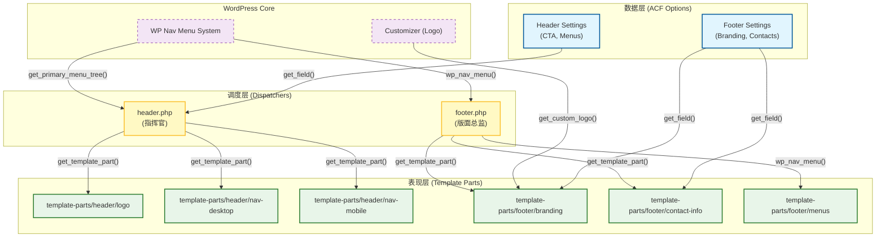
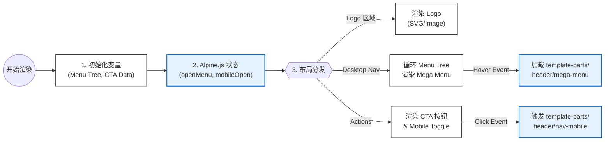
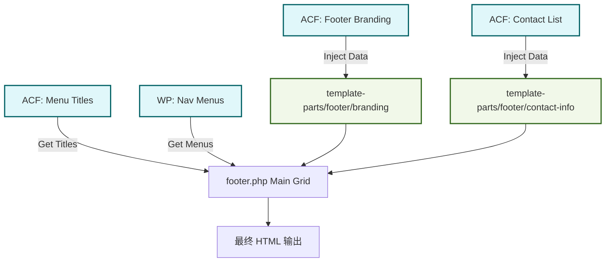

# 全局模块架构设计 (Global Module Architecture)

本文档详细描述了 `header.php` 和 `footer.php` 的架构设计，展示了如何通过**关注点分离 (SoC)** 原则，实现前后端逻辑的解耦与高效调度。

## 1. 核心架构图 (System Overview)

整个系统分为三层：
1.  **数据层 (Data Layer)**: ACF Options Page 负责管理全局静态数据。
2.  **调度层 (Dispatcher Layer)**: `header.php` / `footer.php` 负责宏观布局和组件调用。
3.  **表现层 (Presentation Layer)**: `template-parts` 负责具体的 HTML 渲染。

---

## 2. Header 详细流程 (Header Flow)

Header 作为一个高交互区域，需要同时处理数据获取、状态管理 (Alpine.js) 和组件分发。

---

## 3. Footer 详细流程 (Footer Flow)

Footer 侧重于静态内容的展示，数据来源主要为 ACF Global Settings。

---

## 4. 文件职责清单

| 文件路径 | 角色 | 职责描述 | 数据来源 |
| :--- | :--- | :--- | :--- |
| `inc/field/global/header.php` | **数据定义** | 定义 Header 的 ACF 字段（如 CTA 按钮、自定义代码）。 | N/A |
| `inc/field/global/footer.php` | **数据定义** | 定义 Footer 的 ACF 字段（品牌、联系方式、版权）。 | N/A |
| `header.php` | **调度者** | 负责 `<header>` 标签结构，初始化 Alpine.js 状态，调度各个子部件。 | `get_primary_menu_tree()`, ACF Options |
| `footer.php` | **调度者** | 负责 `<footer>` 栅格布局，调用 WP 菜单函数和子部件。 | ACF Options, `wp_nav_menu()` |
| `template-parts/header/*` | **执行者** | 负责具体的 HTML 渲染（如 Mega Menu 面板、移动端抽屉）。 | 父级传递变量 (`set_query_var`) |
| `template-parts/footer/*` | **执行者** | 负责渲染特定的内容块（如 Branding 信息、联系方式列表）。 | 直接调用 `get_field(..., 'option')` |

## 5. 扩展性说明

*   **新增菜单列**: 只需在 `inc/setup.php` 注册新位置，并在 `footer.php` 添加对应调用即可。
*   **修改联系方式**: 客户可直接在后台 "Global Settings > Footer" 中添加/删除/排序联系方式，无需修改代码。
*   **更换 Logo**: 客户在 Customizer 或 Global Settings 中上传新图，全站自动更新。
