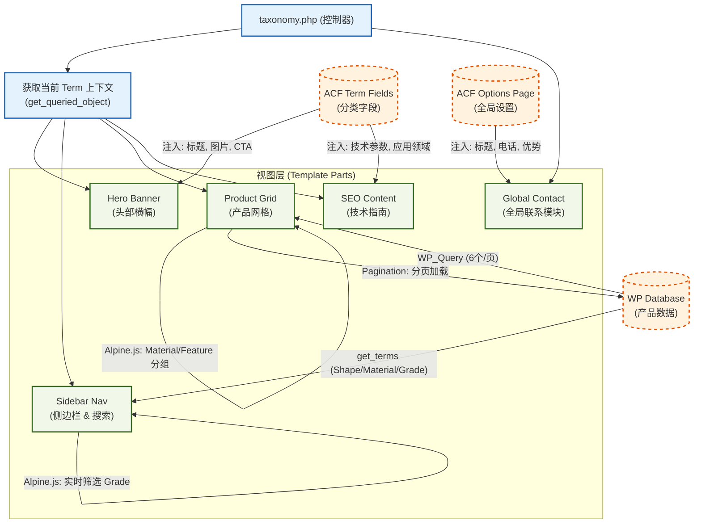

# 分类页架构解析 (Taxonomy Architecture)

本文档阐述了产品分类页 (`taxonomy.php`) 的核心架构、模块拆解及数据流向。该模板统一处理 **Shape (形状)**、**Material (材质)** 和 **Grade (牌号)** 三种分类法。

## 1. 核心架构逻辑

系统采用 **控制器-视图 (Controller-View)** 模式：
*   **控制器**: `taxonomy.php` 负责调度，不直接输出 HTML。
*   **视图**: 各个 `template-parts` 负责具体的渲染逻辑。
*   **数据源**: 结合 ACF 字段（Term Meta & Options Page）与 WordPress 原生查询。

### 架构流程图

---

## 2. 模块详细说明

### A. Hero Banner (头部横幅)
*   **文件路径**: `template-parts/taxonomy/hero.php`
*   **数据来源**: 当前分类的 ACF 字段 (`category-hero.php`)。
*   **逻辑**:
    *   自动获取当前 Term 的名称作为默认标题。
    *   支持自定义 H1 标题（支持 HTML 颜色高亮）。
    *   面包屑导航自动生成。

### B. Sidebar Navigation (侧边栏)
*   **文件路径**: `template-parts/taxonomy/sidebar.php`
*   **数据来源**: `get_terms()` 获取所有分类。
*   **交互 (Alpine.js)**:
    *   **移动端抽屉**: 响应式侧边栏开关。
    *   **Grade 搜索**: 客户端实时过滤 Grade 列表，无需刷新页面。

### C. Product Grid (产品网格)
*   **文件路径**: `template-parts/taxonomy/grid.php`
*   **数据来源**: `WP_Query` (由 `inc/query-filters.php` 控制，限制 6 个/页)。
*   **逻辑**:
    *   **分页加载**: 使用标准 WordPress 分页 (`paginate_links`)。
    *   **智能分组**: 遍历当前页的 6 个产品，根据 `product_tag` 是否包含 `feature`，将产品自动分配到 **"By Material"** 或 **"By Feature"** 标签页。
    *   **注意**: 分页是基于所有产品的，因此某一页可能只包含某一种类型的产品。

### D. SEO / Technical Guide (技术指南)
*   **文件路径**: `template-parts/taxonomy/seo-content.php`
*   **数据来源**: 当前分类的 ACF 字段 (`category-seo.php`)。
*   **作用**: 位于页面底部，提供长篇技术参数、属性列表和应用领域，用于增强 SEO 权重。

### E. Global Contact (全局联系模块)
*   **文件路径**: `template-parts/global/global-contact.php`
*   **数据来源**: ACF Options Page (全局设置)。
*   **架构**:
    *   **左侧**: 全局统一的文案（标题、电话、核心优势）。
    *   **右侧**: 调用原子组件 `form-consult.php`，实现表单功能。

---

## 3. 后端字段映射 (ACF)

| 模块 | 作用域 | 配置文件 | 关键字段 |
| :--- | :--- | :--- | :--- |
| **Hero** | Taxonomy: All | `inc/field/taxonomy/category-hero.php` | `hero_title`, `hero_image` |
| **SEO** | Taxonomy: All | `inc/field/taxonomy/category-seo.php` | `tech_guide_benefits`, `tech_guide_apps` |
| **Contact** | Options: Global | `inc/field/global/global-contact.php` | `global_contact_title`, `global_contact_strengths` |

## 4. 开发规范约定

1.  **零逻辑控制器**: `taxonomy.php` 只负责 `get_template_part`，严禁包含复杂的 PHP 逻辑。
2.  **原子化组件**: 表单等通用组件被拆分为 "Atom"，可在 Global Section 和 Gutenberg Block 中复用。
3.  **数据扁平化**: ACF 字段定义中严禁使用 Group 嵌套（Repeater 除外），确保 `get_field` 调用简单直接。
4.  **查询隔离**: 任何对主查询的修改（如分页数量）必须通过 `pre_get_posts` 钩子在 `inc/query-filters.php` 中进行，严禁在模板文件中直接修改全局 `WP_Query`。

---

## 5. 复杂度评定 (Complexity Assessment)

### 总体评级: B+ (中高复杂度)

本页面不再是简单的 WordPress Archive 页面，而是一个 **"混合型单页应用 (Hybrid SPA)"**。

| 维度 | 评分 | 评定理由 |
| :--- | :--- | :--- |
| **数据源复杂度** | ⭐⭐⭐ | 涉及 3 个不同的数据源：Term Meta (当前分类)、Options Page (全局设置)、WP_Query (产品列表)。需要协调不同作用域的数据。 |
| **交互复杂度** | ⭐⭐⭐⭐ | 深度依赖 Alpine.js。侧边栏实现了客户端实时搜索 (Client-side Search)，网格实现了无刷新 Tab 切换。逻辑从后端转移到了前端。 |
| **结构复杂度** | ⭐⭐ | 采用了良好的原子化拆分，`taxonomy.php` 本身非常干净。文件结构清晰，维护成本可控。 |
| **扩展性风险** | ⭐⭐⭐ | 当前架构对"小而美"的 B2B 目录非常高效，但对数据量极其敏感（详见优化建议）。 |

---

## 6. 优化与重构建议 (Optimization & Refactoring)

虽然当前架构满足 Phase 1 需求，但随着产品数量增加，以下潜在瓶颈需要关注：

### A. 性能隐患：全量加载 (The "Load All" Risk)
*   **现状**: `grid.php` 使用 `'posts_per_page' => -1` 加载当前分类下的**所有**产品。
*   **问题**: 这是为了实现前端 "Material vs Feature" 的 Tab 切换。如果某分类下产品超过 100 个，页面加载速度将显著下降，且 DOM 节点过多会导致浏览器卡顿。
*   **优化方案**:
    1.  **短期**: 设置上限（如 100 个），并添加 "View More" 链接。
    2.  **长期**: 改为 **AJAX 加载**。点击 Tab 时，通过 REST API 请求对应标签的产品数据，而非页面初始化时一次性输出。

### B. 架构解耦：View Model 模式
*   **现状**: `template-parts` 内部直接调用 `get_field()` 获取数据。
*   **问题**: 视图层 (View) 与 数据层 (Model) 强耦合。如果未来想把 ACF 换成其他字段库，或者想复用这个模板渲染非 ACF 数据，修改成本极高。
*   **优化方案**:
    *   在 `taxonomy.php` 控制器中引入 **Data Provider**。
    *   控制器准备好纯数组数据 `$hero_data`, `$sidebar_data`。
    *   通过 `set_query_var()` 传递给模板。
    *   *结果*: 模板将变成纯粹的 HTML 渲染器，不再依赖 WordPress/ACF 函数。

### C. 缓存策略 (Caching Strategy)
*   **现状**: 每次访问分类页，侧边栏都会执行 3 次 `get_terms` (Shape, Material, Grade)。
*   **问题**: 分类树结构通常很不常变动，但查询开销却在每一次 PV 中发生。
*   **优化方案**:
    *   使用 **WordPress Transients API**。
    *   将侧边栏的 HTML 或数据结构缓存 24 小时。
    *   当管理员更新分类时（钩子 `created_term`, `edited_term`），自动清除缓存。
